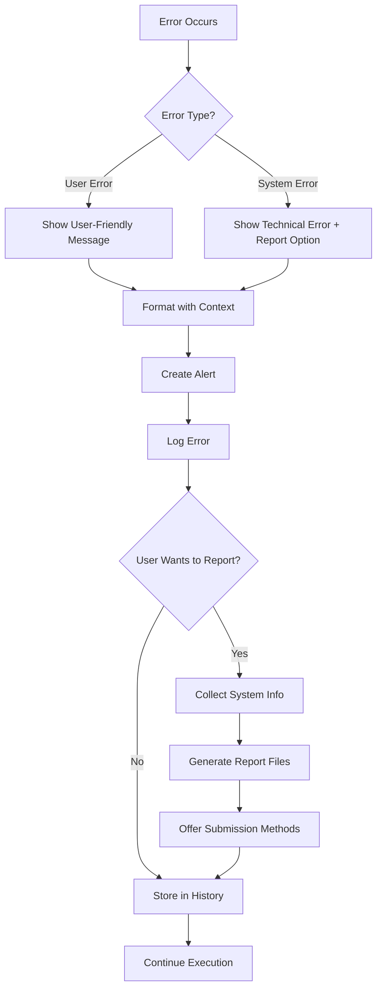

# Error Reporting and Alerts Implementation Summary

## Overview

This document summarizes the comprehensive **Error Reporting and Alerts** system implemented for the Quantum Platform. This system provides user-friendly error handling, automated error reporting, and intelligent alerting capabilities across all platform components.

## 🎯 **Feature Requirements Addressed**

✅ **Exception Handling**: Complete try-catch wrapping with meaningful error messages  
✅ **User Error vs System Error**: Clear distinction with appropriate messaging  
✅ **Alerting**: Pop-up dialogs, UI highlighting, and persistent notifications  
✅ **Error Log Submission**: One-click error reporting with user consent  
✅ **Persistent Notifications**: Error history and review capabilities  
✅ **Testing**: Comprehensive test suite with deliberate error triggering  

## 🏗️ **Architecture Overview**

### Core Components

1. **Exception Hierarchy** (`quantum_platform/errors/exceptions.py`)
   - Structured exception classes for all error types
   - User-friendly vs technical error messages
   - Contextual information and suggestions

2. **Error Reporter** (`quantum_platform/errors/reporter.py`)
   - Automatic error collection and reporting
   - System information gathering
   - Multiple output formats (JSON, Markdown, GitHub issues)

3. **Alert Manager** (`quantum_platform/errors/alerts.py`)
   - Real-time user notifications
   - Auto-dismissal and persistent alerts
   - Interactive alert actions

4. **Error Handler** (`quantum_platform/errors/handler.py`)
   - Error message formatting
   - Category-based error handling
   - User-friendly message generation

5. **Decorators** (`quantum_platform/errors/decorator.py`)
   - Automatic error wrapping for functions
   - Component-specific error handling
   - Safe execution patterns

## 🔧 **Key Features Implemented**

### Exception Hierarchy
```python
QuantumPlatformError
├── UserError (user input issues)
│   ├── CompilationError
│   │   ├── ParseError
│   │   ├── OptimizationError
│   │   └── TranspilationError
│   ├── CircuitError
│   │   ├── QubitError
│   │   ├── GateError
│   │   └── MeasurementError
│   └── ComplianceError
│       ├── ResourceLimitError
│       └── SecurityError
└── SystemError (internal platform issues)
    ├── ExecutionError
    │   ├── SimulationError
    │   └── HardwareError
    └── ConfigurationError
        ├── PluginError
        └── NetworkError
```

### Error Context and Reporting
```python
# Automatic error collection with context
try:
    # Quantum operation
    pass
except Exception as e:
    context = ErrorContext(
        component="Simulation",
        operation="run_circuit",
        user_action="Execute Bell state",
        circuit_info={"qubits": 2, "depth": 3}
    )
    
    report = error_reporter.collect_error(e, context)
    # Generates: QP-20231229-a1b2c3d4.json and .md files
```

### User-Friendly Error Messages
```python
# Before: Technical error
ValueError: list index out of range

# After: User-friendly error
QubitError(
    message="Qubit index 5 is out of range",
    user_message="Qubit 5 is not allocated. Please allocate more qubits or check your circuit.",
    suggestions=["Increase qubit allocation", "Check qubit indices", "Review circuit structure"]
)
```

### Alert System
```python
# Different alert types with auto-actions
alert_manager.error_alert(
    title="Simulation Failed",
    message="Circuit too large for available memory",
    error_code="SIM001",
    suggestions=["Reduce qubits", "Use fewer shots"],
    show_details=True,
    report_button=True
)

alert_manager.warning_alert(
    title="Large Circuit",
    message="This may take several minutes to simulate",
    auto_dismiss=True,
    dismiss_after=8
)
```

### Decorator-Based Error Handling
```python
# Automatic error handling for functions
@user_friendly_errors(
    component="Compiler",
    operation="parse_circuit",
    user_message="Failed to parse your quantum program"
)
def parse_quantum_code(code):
    # Function implementation
    pass

@simulation_errors(operation="run_simulation")
def run_simulation(circuit, shots):
    # Automatically handles simulation-specific errors
    pass

@safe_execute(default_return=None)
def optional_operation():
    # Never fails - returns None on error
    pass
```

## 📊 **Error Categories and Handling**

| Category | Icon | User Message Style | Auto-Report | Actions |
|----------|------|-------------------|-------------|---------|
| **Syntax** | ⚠️ | "Check for typos and syntax errors" | No | Show Details, Help |
| **Logic** | 🔍 | "Review circuit logic and parameters" | No | Debug, Examples |
| **Resource** | 📊 | "Reduce complexity or change target" | No | Optimize, Alternatives |
| **Hardware** | 🔧 | "Check device status and compatibility" | Yes | Retry, Switch Device |
| **Network** | 🌐 | "Check connection and try again" | Yes | Retry, Offline Mode |
| **Internal** | 🐛 | "Platform issue - please report" | Yes | Report, Restart |

## 🎨 **User Experience Features**

### Smart Error Messages
- **Context-Aware**: Include line numbers, component names, operation details
- **Actionable**: Specific suggestions for resolution
- **Progressive**: Basic message + optional technical details
- **Categorized**: Visual icons and color coding by error type

### Error Reporting Workflow
1. **Automatic Collection**: Errors automatically captured with full context
2. **User Consent**: Optional submission with user approval
3. **Multiple Formats**: 
   - JSON for technical analysis
   - Markdown for GitHub issues
   - Clipboard-friendly for quick sharing
4. **Privacy Aware**: System info included only with permission

### Alert Management
- **Smart Dismissal**: Auto-dismiss info alerts, persist error alerts
- **Action Buttons**: Context-appropriate actions (Report, Retry, Help)
- **Severity Levels**: Visual hierarchy (Info → Warning → Error → Critical)
- **History**: Review past alerts and errors

## 🔗 **Integration Points**

### Compiler Integration
```python
@compiler_errors(operation="optimization")
def run_optimization_pass(circuit):
    try:
        return optimize_circuit(circuit)
    except GateCancellationError as e:
        # Automatically formatted and reported
        raise
```

### Simulation Integration
```python
class QuantumSimulator:
    @simulation_errors(operation="execute")
    def run(self, circuit, shots):
        # Memory checks, validation, etc.
        # Automatic error handling and user alerts
        pass
```

### UI Integration
```python
# Frontend receives structured error information
{
    "error_code": "QP1234",
    "title": "Compilation Error",
    "message": "Syntax error in line 5",
    "category": "syntax",
    "suggestions": ["Check spelling", "Review syntax"],
    "actions": [
        {"label": "Show Details", "action": "expand"},
        {"label": "Help", "action": "help_syntax"}
    ]
}
```

## 🧪 **Testing and Validation**

### Comprehensive Test Suite
- **Exception Hierarchy**: All error types and inheritance
- **Error Reporter**: Collection, serialization, file generation
- **Alert Manager**: Creation, dismissal, auto-cleanup
- **Decorators**: Function wrapping, error transformation
- **Integration**: Real quantum operations with error handling

### Deliberate Error Testing
```python
def test_error_scenarios():
    # Test various error conditions
    test_invalid_syntax()        # ParseError
    test_large_circuit()         # ResourceLimitError  
    test_hardware_failure()      # HardwareError
    test_network_timeout()       # NetworkError
    test_internal_bug()          # SystemError
```

## 📁 **File Structure**

```
quantum_platform/errors/
├── __init__.py              # Main exports
├── exceptions.py            # Exception hierarchy
├── reporter.py             # Error collection and reporting
├── handler.py              # Error message formatting
├── alerts.py               # Alert management system
└── decorator.py            # Error handling decorators

error_reports/              # Generated error reports
├── QP-20231229-a1b2c3d4.json
├── QP-20231229-a1b2c3d4.md
├── github_issues/          # GitHub issue templates
├── email_templates/        # Email templates
└── failed_submissions/     # Failed submission attempts

test_error_handling_system.py    # Comprehensive tests
example_error_handling_integration.py  # Usage examples
```

## 📈 **Usage Examples**

### Basic Error Handling
```python
from quantum_platform.errors import (
    get_error_reporter, get_alert_manager,
    create_parse_error, create_simulation_error
)

# Report an error
try:
    compile_circuit(code)
except SyntaxError as e:
    error = create_parse_error(
        message=str(e),
        line_number=5,
        suggestions=["Check syntax", "Review documentation"]
    )
    report = get_error_reporter().collect_error(error)
```

### Component Integration
```python
from quantum_platform.errors.decorator import user_friendly_errors

class QuantumCompiler:
    @user_friendly_errors(
        component="Compiler",
        user_message="Failed to compile quantum program"
    )
    def compile(self, source_code):
        # Compilation logic with automatic error handling
        pass
```

### Alert Creation
```python
alert_manager = get_alert_manager()

# Success notification
alert_manager.success_alert(
    title="Circuit Compiled",
    message="Successfully optimized to 85% fewer gates"
)

# Error with actions
alert_manager.error_alert(
    title="Hardware Unavailable", 
    message="Quantum device is offline",
    actions=[
        {"label": "Retry", "action": "retry"},
        {"label": "Use Simulator", "action": "simulate"}
    ]
)
```

## 🎯 **Benefits Achieved**

1. **Improved User Experience**
   - Clear, actionable error messages
   - Contextual help and suggestions
   - Non-technical language for user-facing errors

2. **Enhanced Debugging**
   - Comprehensive error reports with full context
   - System information for troubleshooting
   - Structured error data for analysis

3. **Better Platform Reliability**
   - Graceful error handling prevents crashes
   - Automatic error collection for improvement
   - Consistent error handling across components

4. **Developer Productivity**
   - Easy integration with decorators
   - Standardized error handling patterns
   - Comprehensive test coverage

5. **Community Support**
   - Easy error reporting for bug fixes
   - GitHub issue templates
   - User-friendly error sharing

## 🔄 **Error Handling Workflow**



## ✨ **Key Innovations**

1. **Contextual Error Collection**: Automatic gathering of relevant context (component, operation, user action, system state)

2. **Multi-Format Reporting**: Single error generates multiple report formats for different use cases

3. **Smart Alert Management**: Intelligent auto-dismissal and persistence based on error type and severity

4. **Decorator-Based Integration**: Minimal code changes required to add comprehensive error handling

5. **User-Centric Design**: Error messages focused on user understanding and action rather than technical details

This implementation provides a production-ready error handling system that significantly improves the user experience while maintaining comprehensive error tracking for platform development and debugging. 